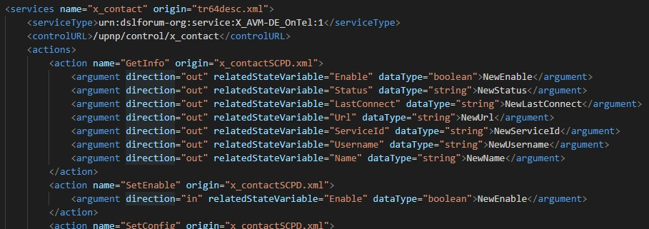

# fritzsoap

**First things first!** Since version 2.x class structure changed and therefore a new instantiation of the classes and their SOAP-clients (see [Usage](#usage)) is required.

## Purpose


This class provides functions to read and manipulate data via TR-064 and UPnP (IGD) interfaces on FRITZ!Box routers and FRITZ!Repeater from [AVM][AVM].
For example, the FRITZ!Box 7590 provides over **500** interfaces (**actions**) in more than **50 services**.

For reference, it is highly recommended to consult the [information AVM provides for interfaces][interfaces]!
Despite the large number of actions, not everything that is displayed or parameterized via the FRITZ!OS GUI can be queried or adapted via these interfaces (see [Wishes](#wishes)).
This library was created to make the large number of interfaces as easy to use as possible.

## Excerpt

You just have to take care of little to perform a desired SOAP action. The matching SOAP client only needs to be called with the instantiation of its dedicated class and gets automatically the correct **location** (serviceType) and **uri** (locationURL).
So you just need to know what **action** you need and in what **service** it is provided. Than you know which **class** you need to instantiate and how the function is namened - that´s all!

**For example you would like to get the current list of callers:**
In this particular case the required *action* `GetCallList` is provided by the `x_contact` *service*. Therefore, the coding is quite simple as follows:

```PHP
$fritzbox = new x_contact($url, $user, $password);
$callList = $fritzbox->getCallList();
```

That´s all! **Simple, convenient, straightforward!**

The file `fritzsoap.php` is the meta class providing general basic objects. All other files are subclasses as descendants of this meta class. The **direct instantiation of fritzsoap leads to an error**.

### Classes and methods

**Each subclass refers to exactly one service!** The naming is identical. In every particular class there is also one function for each action! The **function name matches the name of the action** - follows general PHP language rules: no hyphens and PSR-1: *camelCase*.
For example, the
`X_AVM-DE_GetIPTVOptimized` **action** is called with the
`x_AVM_DE_GetIPTVOptimized` **function**.

According to PSR, class names should be *StudlyCaps*. Due to the object orientation and the therefore dynamic determination of the dedicated classes for the service, this had to be deliberately avoided.

### Additional functions

In some cases, the respective classes contain a few other useful functions that make it easier to call up the interfaces. These additionally coded functions are then listed in the header and their coding can be found at the end of the respective files.

In addition, the parent class `fritzsoap.php` inherits a few more functions:

* public:
  * `getClient()`
  * `getServiceDescription()`
  * `getURL()`
  * `getServerAddress()`
* protected:
  * `getFritzBoxServices()`
  * `errorHandling()`
  * `boolToState()`
  * `arrayToXML()`

The use of the functions is described in their respective headers.

### Useful dependency

In addition, this repository uses [fbvalidateurl][fbvalidateurl] (is automatically installed by Composer). So you do not have to worry about whether you enter the router address with or without scheme (`http://`/`https://`), with hostname (`fritz.box`) or IP (`192.168.178.1`).
Based on the validated URL, the **correct SOAP port** is also determined automatically!

### Refreshing SID

Keep in mind that if programs have been running for a longer time, the [SID][sid] may need to be renewed by calling the `getClient()` function!
So what does long time mean?
The [AVM documentation][interfacetechnicalnote] is also imprecise here: "...*Once it has been assigned, a session ID is valid for **20** minutes. The validity is extended automatically whenever access to the FRITZ!Box is active*..." and in the same document: "...*A session can be ended at any time by deleting the session ID, even before the automatic **10**-minute timeout kicks in*..."

## Genesis

Due to the large number of services and actions provided, it was impossible to code this all manually! So **all subclasses were originally generated by a program!**
Base of this generation are the service description files (XML) of my FRITZ!Box 7590. All devices provide these description files via the SOAP port (e.g. `//fritz.box:49000/tr64desc.xml`). Read the information available there and generate the code from it was the easiest and flawless way to transfer the large amount of services, their actions and parameters into a generic structure of classes.

If you wanna know more more about this, have a closer look into the `fritzsoap.php`. **The generation program is based on a specific subclass, which is NOT part of this library**, because generating the classes redundantly on premise does not makes sense.

### Missing services/actions

If, contrary to expectations, **you receive services** with `getServiceDescription(true)` that are **not included here**, then simply send me the generated XML (email adress in every file header) and I will generate the missing class from it (Needless to say, there is no need to worry about privacy, as the XML does not contain any private data nor credentials).

Such a case can occur if your FRITZ!Box provides more than three WLAN access points, then you may be missing the service `wlanconfig4`.

### Doublets

* WAN* services (capital letters!) refer to IGD1 resp. IGD2 descriptions and therefore appear twice: as `WAN*1_1.php` and `WAN*1_2.php`.
* wlanconfig* is found according to the number of access points provided (2400 GHz, 5000 GHz, guest, ...)
* [Control_*](#control) see below

### Completion

Most of the actions are reviewed and coding is ready to use. In all other cases you will find in the class header comment either a disclaimer: `THIS FILE IS AUTOMATIC ASSEMBLED BUT PARTLY REVIEWED!` or `THIS FILE IS AUTOMATIC ASSEMBLED!` if this class is still generic and nothing is reviewed yet.

If no coding has been reviewed for your desired action the existing examples should show how easy it is to complete the code of that function for your desired action (**contributions to extend this class are highly appreciated!**).
In about half of the cases (if there are no input parameters), it is sufficient to adapt the message for a possible error, since the actions mainly provide arrays with return values that can be further processed by the calling program.

You will see if a function coding has been checked, when you look at the comments. In all other cases untouched functions are looking like the following example of an unreviewed function (from `x_homeauto.php`):

```PHP
/**
 * setSwitch
 *
 * automatically generated; complete coding if necessary!
 *
 * in: NewAIN (string)
 * in: NewSwitchState (string)
 *
 * @param string $aIN
 * @param string $switchState
 * @return void
 */
public function setSwitch($aIN, $switchState)
{
    $result = $this->client->SetSwitch(
        new \SoapParam($aIN, 'NewAIN'),
        new \SoapParam($switchState, 'NewSwitchState'));
    $this->errorHandling($result, 'Could not ... from/to FRITZ!Box');
}
```

You will find the input or output parameter (arguments) in the comment section and in the function coding - if it has any. To facilitate the completion of this creation just take a closer look at finished functions.

But as I said before:

* it is highly recommended to consult the information [AVM provides for interfaces][interfaces]
* contributions are highly appreciated. Share your enhancements! With your PR, everyone benefits from further completion!

### Ghosts

#### Services

Automatic generation has also originate services that are not or not clearly [documented by AVM][tr064overview]. Accordingly, these classes have **no link to a reference document in the class comment!**

These presumably refer to specifications from Open Connectivity Foundation (aka UPnP-Forum). But parsing that or keeping track of it manually is far beyond my capabilities.

In all other cases you will find a link like this:

```PHP
 * @see: https://avm.de/fileadmin/user_upload/Global/Service/Schnittstellen/*.pdf
```

##### AURA (AVM USB Remote Access)

There is one exception so far: `AURA`. Through a [thread in the IP Phone Forum][auradiscussion] I learned how this service works. The six actions of this service are coded and an [unofficial documentation](docs/auraSCPD.pdf) can be found in the `/docs` folder.
You must have activated the USB remote access function in the FRITZ!Box to be able to access this service!

##### Some other ghosts

* `any` has no actions - generic template for [aura][aura]?
* `avmnexus`
* `fritzbox` disappeared with FRITZ!OS 7.29 (or before?) but reappeared with 7.50
* `l2tpv3`

##### Control

Up to and including FRITZ!OS 7.29 there was a group of `Control` services of the same name, of which I found seven with different serviceType and controlURL. The services are therefore mapped accordingly in the classes **Control_1** to **Control_7**. With FRITZ!OS 7.50 no longer included in the description files, I keep them here for the sake of completeness.

#### Actions

In some cases actions are defined in the *SCPD.xml, which are not documented and/or do not exist. In the latter case, the result is SOAP fault 403 (Not available Action). As far as this was determined in the following note can be found in the header of the function:

```PHP
     * ACTION IS NOT IN THE FILE ABOVE DOCUMENTED!
```

## Requirements

* PHP 8.2 or higher (php-soap, php-xml)
* [Composer][composer]

## Installation

You can install it through Composer:

```js
"require": {
    "blacksenator/fritzsoap": "^2.8"
},
```

or

```console
git clone https://github.com/blacksenator/fritzsoap.git
```

## Usage

### Authentication

There are a few services (IGD-related) that can be called without any(*) credentials:

* WANCommonIFC1
* WANDSLLinkC1
* WANIPConn1
* WANIPv6Firewall1

plus the above mentioned [additional public functions](#additional-functions)
(*) because of the usage of [fbvalidator](#useful-dependency) `fritz.box` is used as default adress

All others require the specification of the FRITZ!Box URL, user and password.

### Examples

Below are a few examples of how the provided actions or additional functions can be called:

If you wanna get a file with all the available services of your FRITZ!Box or FRITZ!Repeater:

```PHP
require_once('vendor/autoload.php');

use blacksenator\fritzsoap\x_contact;

$fritzbox = new x_contact;  // no credentials needed in this particular case!
$services = $fritzbox->getServiceDescription();
$services->asXML('services.xml');
```

**Hint:** The function `getServiceDescription()` is available in all classes due to inheritance and available without any credentials and provides a good overview! You can also get a more detailed structure with `getServiceDescription(true)`. In this case all parameters of the actions are also output, as well as the file name of the XML from which the information originates.

Example output (clipping):


But now some more practical applications:
Example to get a list of all your network devices:

```PHP
$fritzbox = new hosts($url, $user, $password);
$meshList = $fritzbox->getMeshList();
```

Example to dial a number (connected to one of your phone devices: click to dial):

```PHP
$fritzbox = new x_voip($url, $user, $password);
$fritzbox->x_AVM_DE_DialNumber('030399760');
```

In addition, it is also possible to dial everything that is otherwise possible by dialing with the FRITZ!Box: internal telephone numbers, keyboard codes for controlling calls, etc. . The transmission of AT commands is not possible, nor is the handling of incoming calls.
**Keep in mind**, that you have to activate "click to dial" (Wahlhilfe), if you wanna use `x_AVM_DE_DialNumber()` or `x_AVM_DE_HangUp()`. You can even get the status and (de-)activate this feature per programm with `x_AVM_DE_DialGetConfig()` and `x_AVM_DE_DialSetConfig()`. Therefore have a closer look at `x_voip.php` with helpful functions `x_AVM_DE_GetPhonePort()` e.g. `getPhonePorts()`.

### Exception handling

By default the SOAP parameter `exceptions` is set to `false` in `fritzsoap.php` and its descendants:

```PHP
SOAP_EXCEPTIONS = false,
...
'exceptions' => self::SOAP_EXCEPTIONS,
```

Therefore, a SOAP error does not throw an exception! A more convenient routine is linked to each and every function call and, in the event of an error, the `$result` variable does not carry the requested value(s) but the [SoapFault](https://www.php.net/manual/de/class.soapfault.php) information, which outputs the errors defined by AVM with number and description, which can also be found in the relevant document for the particular service.

In certain cases it can make sense not to use this implemented routine

```PHP
if ($this->errorHandling($result, 'Could not ... from/to FRITZ!Box')) {
```

and instead to [query it][query] yourself

```PHP
if (is_soap_fault($result)) {
```

### Error handling

If calling a class or its functions leads to an error, possible causes could be:

* the [necessary php modules](#requirements) are not installed
* your FRITZ!Box/FRITZ!Repeater does not provide the service (range of functions depending on the FRITZ!Box model?)
* your settings:
  * the lack of activation of certain functions in the FRITZ!Box (e.g. UPnP or USB remote access)
  * that the FRITZ!Box [user does not have the appropriate rights](https://avm.de/fileadmin/user_upload/Global/Service/Schnittstellen/AVM_TR-064_first_steps.pdf) (e.g. TR-064 access)

## Wishes

First of all, it has to be said that the TR-064 interface is a great thing. Although around 500 actions give **the impression that almost everything of the FRITZ!Box can be output or changed via SOAP, this is of course not true**!
From my point of view, actions (functions) are missing for some interesting output and tasks. Just to highlight a few:

* telephony
  * disconnect/reject inbound calls (for a workaround see [miniSIP4fb][minisip]))
* parental controls
  * get connected devices with their profile
  * change filters/profile of devices
  * get ticket list as array with state
* USB devices
  * get connected memory devices
  * disconnect/reconnect those devices

Apart from that, there are a number of actions where it is unclear which value is to be passed as input, or there is no action that provides the input parameter. Last but not least, there are cases where a get-action returns a value (e.g. `NewDeviceHandle`) that is obviously expected as input by the next action `getDeviceByHandle()` - but is not accepted at all.

## Disclaimer

FRITZ!Box, FRITZ!Repeater, FRITZ!OS are trademarks of [AVM](https://avm.de/). This software is **in no way affiliated** with AVM and only uses the [interfaces published by them][interfaces].

## License

This script is released under MIT license.

## Author

Copyright (c) 2019 - 2025 Volker Püschel

[minisip]: https://github.com/blacksenator/miniSIP4fb
[query]: https://www.php.net/manual/de/function.is-soap-fault.php
[aura]: https://github.com/blacksenator/fritzsoap/blob/ff3726759f92944af365e089a6ffb86a5902591a/src/aura.php#L27
[auradiscussion]: https://www.ip-phone-forum.de/threads/v0-4-1-30-09-2009-fritzboxnet-net-bibliothek-f%C3%BCr-fritz-box.190718/
[interfaces]: https://avm.de/service/schnittstellen/
[AVM]: https://en.avm.de/
[fbvalidateurl]: https://packagist.org/packages/blacksenator/fbvalidateurl
[sid]: https://avm.de/fileadmin/user_upload/Global/Service/Schnittstellen/AVM_Technical_Note_-_Session_ID.pdf
[interfacetechnicalnote]: https://avm.de/fileadmin/user_upload/Global/Service/Schnittstellen/AVM_Technical_Note_-_Session_ID_english_2021-05-03.pdf
[tr064overview]: https://avm.de/fileadmin/user_upload/Global/Service/Schnittstellen/AVM_TR-064_overview.pdf#page=2
[composer]: https://getcomposer.org/download/
