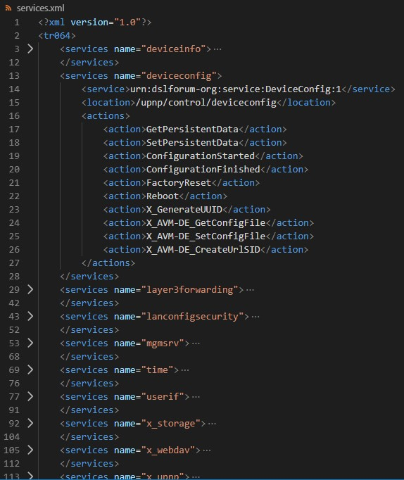

# fritzsoap

**Attention!** A word in advance: This version 2.x has a completely changed class structure and therefore a new instantiation of the classes and their SOAP-clients (see [Usage](#usage))

## Purpose

This class provides functions to read and manipulate data via TR-064 interface on FRITZ!Box routers from [AVM](https://en.avm.de/).
Due to the large number of **actions** provided (more than 400), only a few of them are **coded as functions** ready for use!

## Excerpt

With the instantiation of the class, **all available services of the addressed FRITZ!Box are determined**. So you just have to take care of little, to perform the desired action.
The services and actions are provided in a compressed form as XML and can be output with `getServiceDescription()`.

Example output:



The matching SOAP client only needs to be called with the instantiation of its class and gets automatically the correct **location** and **uri** from this XML.
So you just need to know what **action** you need and in what **service** it is provided. Than  you know which class you need to instantiate - that is the difficult part!
For reference, it is highly recommended to consult the [information AVM provides for interfaces](https://avm.de/service/schnittstellen/)!

If no coding has been done for your desired action in this class - which is probably the case - the existing examples (see [Completion](#completion)) should show how easy it is to code a function for your desired action (**contributions to extend this class are highly appreciated!**).

In addition, this class uses [fbvalidateurl](https://packagist.org/packages/blacksenator/fbvalidateurl). So you do not have to worry about whether you enter the router address with or without scheme (`http://`/`https://`), with hostname (`fritz.box`) or IP (`192.168.178.1`). Based on the validated URL, the **correct SOAP port** is also determined automatically!

## Inheritance

`fritzsoap.php` is the main class providing general basic objects. All other subclasses are extension of this class. You usually use this subclasses. **Each subclass refers to exactly one service!**

## Genesis

Please note: **All subclasses were generated by a program!**
Base of this generation are the service description xml files of my FRITZ!Box 7490. That was an easiest and flawless way to transfer the large amount of services and their actions into a generic structure of classes.

### Completion

Round about 5% of the actions are reviewed coding is finished ready to use. If so, you will find in the class header comment:
`THIS FILE IS AUTOMATIC ASSEMBLED BUT PARTLY REVIEWED!` - in all other cases: `THIS FILE IS AUTOMATIC ASSEMBLED!`

You will see if a function coding has been checked when you look at the comments - in all other cases untouched functions are looking like this:

Example of an unreviewed function (from `x_homeauto.php`):

```PHP
/**
 * setSwitch
 *
 * automatically generated; complete coding if necessary!
 *
 * in: NewAIN
 * in: NewSwitchState
 *
 */
public function setSwitch()
{
    $result = $this->client->SetSwitch();
    if (is_soap_fault($result)) {
        $this->getErrorData($result);
        error_log(sprintf("Error: %s (%s)! Could not ... from/to FRITZ!Box", $this->errorCode, $this->errorText));
        return;
    }

    return $result;
}
```

* First thing to point out: the function name matches the name of the action - following php coding rules (first char lower case and no hyphens).
* Secondly: you will find the input or output parameter (arguments) in the comment section of the function - if it has any.

To facilitate the completion of this creation take a look at the finished functions to transfer the use of the input and output parameters and to adjust the return of the function (`x_contact.php` is the most productive source at the moment).

Just one example to show the usage of input parameters:
```PHP
$result = $this->client->AddPhonebook(
    new \SoapParam($name, 'NewPhonebookName'),
    new \SoapParam($phoneBookID, 'NewPhonebookExtraID')
);
```
But as I said before:
* it is highly recommended to consult the information [AVM provides for interfaces](https://avm.de/service/schnittstellen/) -  even if **the documentation offered there is horrible and has a number of errors!**
* contributions are highly appreciated. Share your enhancements! With your PR, everyone benefits from further completion!

### Ghosts

Automatic generation has also identified 14 services that are not officially documented by AVM. I suspect these are interfaces for DSL/Cable providers. Accordingly, these classes have no link to the reference document in the class comment.

## Requirements

  * PHP 7.0
  * Composer (follow the installation guide at https://getcomposer.org/download/)

## Installation

You can install it through Composer:

    "require": {
        "blacksenator/fritzsoap": "^2.0"
    },

or

    git clone https://github.com/blacksenator/fritzsoap.git

## Usage
Example if you wanna know your available services:

    $fritzbox = new x_contact($url, $user, $password);
    $services = $fritzbox->getServiceDescription();
    $services->asXML('services.xml');

Example to get a list of all your network devices:

    $fritzbox = new hosts($url, $user, $password);
    $fritzbox->getClient();
    $meshList = $fritzbox->x_AVM_DE_GetMeshListPath();

Example to dial a number (connected to one of your phone devices):

    $fritzbox = new x_voip($url, $user, $password);
    $fritzbox->getClient();
    $fritzbox->x_AVM_DE_DialNumber('#9');

## License
This script is released under MIT license.

## Authors
Copyright (c) 2019 Volker Püschel